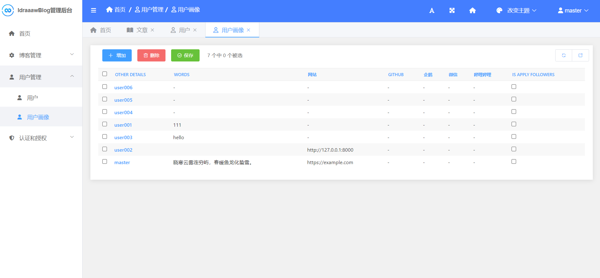

# django-blog

> 一个运用Django编写的简单博客

- Django4.2
- Bootstrap4.6.2

功能：文章发表、分页、评论、友链

## 创建虚拟环境

```shell
> python -m venv venv
# Windows
> venv\Scripts\activate
```

## 安装项目依赖

```shell
# (venv)
> pip install -r requirements.txt
```

## 项目初始化

```shell
# (venv)
> python manage.py makemigrations
> python manage.py migrate
> python manage.py createsuperuser
```

## 运行

```shell
# (venv)
> python manage.py runserver
```
打开浏览器[http://127.0.0.1:8000](http://127.0.0.1:8000)查看演示

`/admin`进入管理页面

## 连接MySQL

安装mysqlclient
```
pip install mysqlclient
```

创建数据库
```sql
# mysql client
CREATE DATABASE <db_name>;
```

修改`settings.py`文件
```python
DATABASES = {
    'default': {
        'ENGINE': 'django.db.backends.mysql',
        'NAME': '<db_name>',
        'USER': '<user>',
        'PASSWORD': '<password>',
        'HOST': 'localhost',
        'PORT': '3306',
    }
}
```

# 服务器部署

# 部分演示截图



